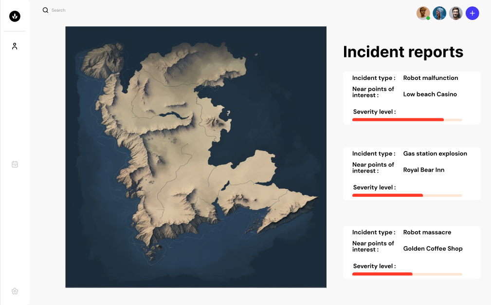
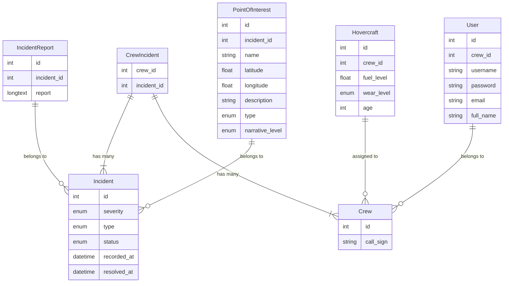

## Introduction

This project is being undertaken under request of Delos' Park Director Robert Ford, with
the goal of optimizing resource deployment for clean-up related tasks for the duration of
the interim underground service tunnel construction period – running from the fourth of
September until the eight, through digital web based technologies. We, the Digital
Desperados software team are tasked with developing this solution.

The Digital Desperado's Incident Management System is a web platform where Delos Incident
crews log in to view ongoing incidents in an interactive map. They can then assign
incidents to themselves, allowing them to update the incidents' status. Upon completion,
they submit a complete incident report. All of this is tracked in the application's
database, fuelling future data driven insights.

## Goal

The purpose of DD Incident Management System is to provide incident crews with a way to
clearly divide tasks amongst themselves, as well as record data on incidents to help
prevent them in the future.

## Target users

The Delos' cleanup crew members, along with their managers, are the target users of this
product. They will use the product for coordinating their daily operations, as well as
gaining insights into their department's operational efficiency.

## Scope

Scope, as described using the MOSCOW principle:

#### must have

These are strictly required for the success of the first version of the product.

-   **Incident tracking system** At minimum, there should be a complete list of all
    incidents. From this list users should be able to navigate to a page containing more
    details on that specific incident.
-   **Incident assignment** Crews should be able to assign themselves to a pending incident,
    so that no two crews get dispatched to the same incident.
-   **Incident management** Incidents need to be able to be viewer, created, updated, and deleted.
    Incidents need various status categories, such as “pending”, “in progress”,
    “resolved”.

#### Should have

These are important for the product, though not strictly necessary.

-   **Incident tracking system** Apart from an incident list, there should be a map
    indicating the locations of pending and in progress incidents.
-   **Incident reports** Upon resolving an incident, crew need to be able to submit
    a report.
-   **Viewing and filtering** The incident listing screen should have buttons available
    for limiting the kind of incidents shown, as well a control the sorting of incidents.

#### Might have

Omission of these features would not be detrimental. Their inclusion in the first version
of the product would be considered a benefit.

-   **Incident tracking system** The incident map might be interactive, allowing users to
    update certain properties of a selected incident directly from the map, as well as
    navigate to that incident's page.
-   **Responsiveness** A UI that adapts to any screen geometry.
-   **JSON REST API** endpoints for reading, creating, updating, and deleting incidents.
    Allow other company tools to interact with our product programmatically.

#### Will not have

These features are considered unimportant or detrimental to the product.

-   **BI reporting** Analysing and summarizing incident data is out of scope for the first
    version of the product.
-   **Inter-team communication** Building a messaging platform for communication between
    teams is not in scope for the product currently. We will instead continue using the
    company's Slack channel.

## User stories

This is a brief list of the initial user stories. For an up-to-date list, view the
projects sprint planning
[here][1].

[1]: (https://bitlab.bit-academy.nl/digital-desperados/digital-desperados/-/boards/495)

| As a (role):  | In order to:                                 |                               I want:                                |
| :------------ | :------------------------------------------- | :------------------------------------------------------------------: |
| User          | Record incidents                             |                 A suitable, flexile database schema                  |
| Product owner | Evaluate costs and benefits                  | A project plan summarizing the minimum specifications of the product |
| Product owner | Protect company interests                    |       A password based authentication and authorization system       |
| User          | Have a clear overview of the pending jobs    |   A dashboard with various summaries of commonly used information    |
| User          | Create, read, update, and delete an incident |                              A webform                               |
| Developer     | Have ease of development                     |        To install and use Tailwind for front-end development         |

## Planning

This outlines the timeline of the project. For details on each task, see the [story board][1]

| Day: | Task:                  | Team members:    | Deliverable:                                                        | Link:      |
| :--- | :--------------------- | :--------------- | :------------------------------------------------------------------ | :--------- |
| 1    | brainstorming          | all              | Per team member- and team-wide summaries                            |            |
| 1    | project plan           | Jonathan, Raymon | project plan document                                               | [story][2] |
| 1    | UML diagram            | Wessel           | UML diagram, for inclusion in project plan                          | [story][3] |
| 1    | Git repository         | Wessel           | Git repo set up, with all team members present                      |            |
| 1    | Set up Laravel project | Wessel           | Ready to go laravel project                                         |            |
| 1    | Set up Tailwind        | Bart             | Working project-local TW configuration                              | [story][4] |
| 2    | project plan           | Jonathan, Raymon | final project plan document                                         | [story][2] |
| 2    | Figma design           | Jonathan         | Visual design, for inclusion in project plan                        | [story][5] |
| 2    | Initial crud pages     | Wessel, Bart     | First iteration of pages for interacting with incidents             | [story][6] |
| 3    | Dashboard page         | Raymon, Bart     | First iteration of dashboard with incident map                      | [story][7] |
| 4    | crud page refinement   | Wessel, Jonathan | Finishing touch to the crud pages                                   | [story][6] |
| 4    | Dashboard refinement   | Bart, Raymon     | Finishing touch to the dashboard page                               | [story][7] |
| 5    | Evaluations            | all              | Constructive feedback, from each team member, to every other member |            |
| 5    | Presentation           | all              | Presenting the project result to management                         |            |

[2]: https://bitlab.bit-academy.nl/digital-desperados/digital-desperados/-/issues/1
[3]: https://bitlab.bit-academy.nl/digital-desperados/digital-desperados/-/issues/7
[4]: https://bitlab.bit-academy.nl/digital-desperados/digital-desperados/-/issues/3
[5]: https://bitlab.bit-academy.nl/digital-desperados/digital-desperados/-/issues/8
[6]: https://bitlab.bit-academy.nl/digital-desperados/digital-desperados/-/issues/4
[7]: https://bitlab.bit-academy.nl/digital-desperados/digital-desperados/-/issues/9

## Technologies

The product will be built in PHP 8.2, using the Laravel framework version 10. The
application will be communicating with a MariaDB version 11 database server. TailwindCSS
will be used to aid in frontend development. Pages will be served using the Apache web
server. These technologies were chosen, as they are the team's speciality. The primary
platform this product will be developed for, is the Delos' own hovercraft mounted
terminal, with large screen and keypad.

## Specification

This section provides an overview of design considerations made, and technologies used, to
arrive at the initial version of the product. The source code of the product can be found
[here](https://bitlab.bit-academy.nl/digital-desperados/digital-desperados)

### Pages

The web application will contain at least to following pages:

-   Dashboard with a map and top 3 incidents overview.
-   Incident listing. A table with a complete list of incidents. Incidents can be sorted
    and filtered.
-   Incident details. A page dedicated to displaying all information related to a single
    incident.
-   Create/edit incident form. A page dedicated to submitting a new incident, or modifying
    aspects of an existing incident.

### Dashboard visual design

### Application architecture diagram

This diagram outlines the initial design of core business domain entities. They will have
tables associated with them in the database mirroring the properties, all according to
Laravel conventions and best practices.

